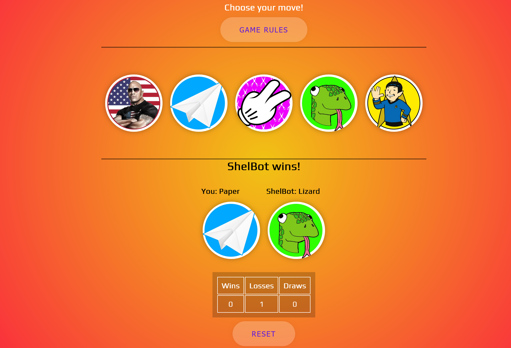
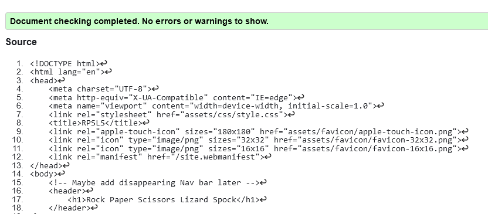
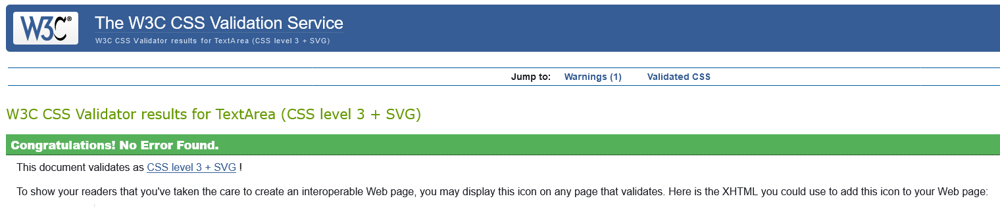

# Rock Paper Scissors Lizard SpockGame

## Purpose

The purpose of this project is to provide a simple and interactive implementation of the "Rock Paper Scissors Lizard Spock" game. It aims to entertain users by allowing them to play the game against a computer opponent and improve their decision-making skills by strategizing various moves.

## Intended Target Audience

This project is designed for individuals of all ages who enjoy casual and engaging games. Whether you're a fan of classic games or looking for a quick and entertaining pastime, this application is suitable for a broad audience. It's user-friendly, accessible, and provides a fun way to spend leisure time.

## Features

- **User Interaction:**
  - Users can make their move by selecting one of the available options: Rock, Paper, Scissors, Lizard, or Spock.
  - The game provides a responsive and interactive interface for a seamless user experience.

- **Computer Opponent:**
  - The computer opponent randomly selects its move, creating a dynamic and unpredictable gaming experience.

- **Scoring System:**
  - A scoring system keeps track of the user's and computer's scores, indicating the winner of each round.

- **Result Display:**
  - The game displays the results of each round, indicating whether it's a draw, a user win, or a computer win.

- **Responsive Design:**
  - The layout and styling are designed to be responsive, ensuring an optimal experience across various screen sizes.

- **Game Rules:**
  - Users can access a pop-up with the rules of the game, providing clarity on the interactions between different moves.

- **Game Reset:**
  - A reset button allows users to start a new game, resetting the scores and game state.

- **Rules Popup:**
  - A responsive pop-up displays the rules of the game when the user clicks a button, enhancing the user's understanding of the game dynamics.

- **Game Outcome Display:**
  - The game result section shows a detailed outcome of each round, including the user's and computer's choices.

- **Scalable Image Options:**
  - The game provides image options for user moves, allowing for an immersive and visually appealing experience.

- **Scoreboard:**
  - A scoreboard displays the current scores for both the user and the computer, keeping users informed about the ongoing competition.

## Testing

### Accessibility

- Wave Report - No Errors or Contrast Errors detected.
- Lighthouse Mobile
- Lighthouse Desktop

### Manual Testing

Responsiveness was tested on:

- Windows and Mac laptops
- Windows Surface Pro 8
- iPad mini
- Samsung S20FE
- iPhone 14

No issues were detected.

Additional Responsiveness testing was completed using Dev Tools in FireFox and Chrome.

Browser testing was done in:

- Edge
- Chrome
- FireFox
- Chrome Mobile Browser
- Safari (Desktop and Mobile)

### Validator Testing

#### HTML

No errors were returned when passing through the official W3C validator.

#### CSS

No errors were found when passing through the official (Jigsaw) validator.

## Unfixed Bugs

There are no identified unfixed bugs on this website.

## Deployment

This section should describe the process you went through to deploy the project to a hosting platform (e.g., GitHub).

The site was deployed to GitHub pages. The steps to deploy are as follows:

1. In the GitHub repository, navigate to the Settings tab.
2. From the source section drop-down menu, select the Master Branch.
3. Once the master branch has been selected, the page will be automatically refreshed with a detailed ribbon display to indicate the successful deployment.

The live link can be found [here](https://bear81.github.io/rockPaperScissorsLizardSpock/).

## Credits

- [Youtube - Keven Powell CSS Tutorial](#)
- [Scrimba - JavaScript Tutorial](#)
- [uiverse.io - Button Styling Website](#)
- [gradientmagic.com - Background](#)
